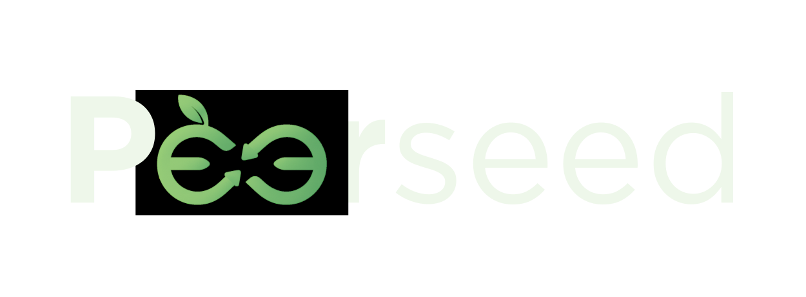

<div align="center">

# Peerseed

</div>

<p align="center">
  
</p>
<p align="center"><i>Uma nova era de crédito para o agronegócio brasileiro.</i></p>

## Integrantes
<div align="center">
  <table>
    <tr>
      <td align="center">
        <a href="https://www.linkedin.com/in/davidijesus">
          <br>
          <sub><b>Davi Nascimento de Jesus</b></sub>
        </a>
      </td>
      <td align="center">
        <a href="https://www.linkedin.com/in/llorengarcia/">
          <br>
          <sub><b>Lorena Garcia</b></sub>
        </a>
      </td>
      <td align="center">
        <a href="https://www.linkedin.com/in/jo%C3%A3o-v-wandermurem/">
          <br>
          <sub><b>João Victor Wandermurem de Oliveira</b></sub>
        </a>
      </td>
    </tr>
  </table>
</div>


## Descrição

**Peerseed** é uma plataforma fintech de crédito P2P (peer-to-peer) projetada para conectar pequenos e médios produtores rurais brasileiros a pessoas físicas interessadas em investir diretamente no agronegócio. Utilizando análise de dados, IA e uma arquitetura de microsserviços em nuvem, nossa missão é criar um ecossistema de crédito mais ágil, transparente e sustentável.

A documentação completa do projeto, incluindo arquitetura, fluxos e modelo de dados, pode ser encontrada em nosso site do Docusaurus.

**[>> Acesse a Documentação Completa Aqui <<](https://jvwandermurem.github.io/Hackathon-Peerseed/)**

### Problema Resolvido

O agronegócio brasileiro enfrenta um paradoxo: enquanto o setor é uma potência, os pequenos e médios produtores rurais sofrem com um acesso restrito e burocrático ao crédito tradicional. Do outro lado, investidores buscam alternativas de investimento com impacto e transparência. O Peerseed resolve esse problema através de:

- **Análise de crédito automatizada** para dar respostas rápidas aos agricultores.
- **Criação de um marketplace** de investimento acessível e transparente.
- **Oferta de liquidez** para investidores através de um mercado secundário.
- **Redução da burocracia** e das altas taxas dos intermediários tradicionais.

## Ecossistema Peerseed

O sistema opera com base em conceitos-chave que garantem seu funcionamento e transparência:

| Conceito | Descrição | Finalidade |
|:---|:---|:---|
| **AgroScore** | Um score de crédito (0-1000) gerado por IA, que analisa dados do produtor e de mercado. | Democratizar e acelerar a análise de risco, oferecendo taxas mais justas. |
| **CPR** | Cédula de Produtor Rural, o título que formaliza o empréstimo do agricultor. | Servir como o ativo base para o investimento, garantindo a segurança jurídica da operação. |
| **Cotas de Investimento** | A CPR é fracionada em pequenas cotas (ex: R$ 100 cada), que são os ativos comprados pelos investidores. | Permitir o investimento pulverizado, reduzindo o risco para o investidor e facilitando a captação. |
| **Mercado Secundário** | Funcionalidade que permite aos investidores venderem suas cotas para outros usuários antes do vencimento da CPR. | Prover liquidez, um dos maiores diferenciais da plataforma. |

## Funcionalidades Principais

### 1. **Análise de Crédito Automatizada (AgroScore)**
- Processo de solicitação 100% digital.
- Análise de risco baseada em dados, gerando um score em minutos.
- Feedback transparente para o agricultor.

### 2. **Marketplace de Investimentos**
- Vitrine de oportunidades de crédito (CPRs) para investidores.
- Informações claras sobre risco, retorno, prazo e impacto de cada projeto.
- Investimento fracionado a partir de pequenos valores.

### 3. **Mercado Secundário para Liquidez**
- Permite que investidores vendam suas cotas a qualquer momento.
- Aumenta a atratividade do investimento ao oferecer uma porta de saída.

### 4. **Carteira Digital Integrada**
- Gestão de saldos, extratos e transações (depósitos, saques, investimentos).
- Suporte para operações via Pix e criptomoedas (stablecoin USDC).

## Estrutura de Pastas

```
peerseed/
├── docs/      # Documentação completa do projeto (Docusaurus)
├── README.md     # Este arquivo
└──LICENSE
```
*[Estrutura de código a ser preenchida com o início do desenvolvimento].*

## Execução do Projeto

### Documentação

A documentação completa do Peerseed pode ser acessada através do link: **[Documentação Peerseed](https://jvwandermurem.github.io/Hackathon-Peerseed/)**

Para executar a documentação localmente (requer Node.js e npm):
```bash
# Clone este repositório
git clone [https://docs.github.com/pt/repositories/creating-and-managing-repositories/quickstart-for-repositories](https://docs.github.com/pt/repositories/creating-and-managing-repositories/quickstart-for-repositories)
cd peerseed/docs/docs 
npm install
npm run start
```

### Execução da Aplicação
*[Instruções detalhadas de execução serão adicionadas com o avanço do desenvolvimento].*

#### Pré-requisitos
***PREENCHER FUTURAMENTE***

#### Instalação
```bash
**PREENCHER FUTURAMENTE**
```

#### Execução
```bash
**PREENCHER FUTURAMENTE**
```

## 🗃 Histórico de Lançamentos

### v0.1.0 (Hackathon QI Tech - Planejamento)
- Definição do Problema, Solução e Proposta de Valor.
- Mapeamento de Personas e Jornadas de Usuário.
- Arquitetura da Solução (C4), Fluxos (UML) e Microsserviços.
- Modelagem de Dados e Definição da Stack Tecnológica.
- Planejamento de Infraestrutura, Segurança, DevOps e Machine Learning.

## Licença

Este projeto está licenciado sob a Licença MIT.

[](https://opensource.org/licenses/MIT)
